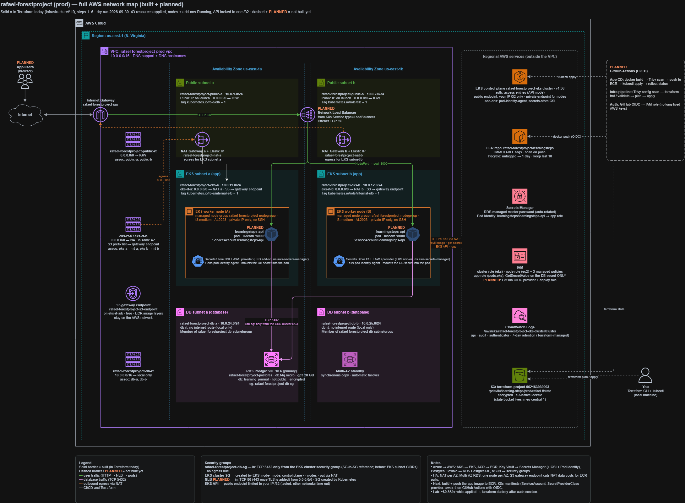

# Learning Steps on AWS

A production-style AWS rebuild of my Azure **Learning Steps** project, written in Terraform.
The Azure version runs a FastAPI app on AKS with ACR, PostgreSQL Flexible Server, Key Vault and NSGs.
This repo moves the same design to AWS: **EKS, ECR, RDS PostgreSQL, Secrets Manager and security groups**, built across two Availability Zones with a security-first mindset.



*Solid = built in Terraform today. Dashed / PLANNED = next steps. Source: [`network-map-full.drawio`](network-map-full.drawio).*

## Architecture

| Layer | What's built |
|---|---|
| **Network** | VPC `10.0.0.0/16` in `us-east-1`, 2 AZs. Per AZ: a public subnet (load balancer, NAT), a private EKS subnet and an isolated DB subnet |
| **Egress** | One NAT gateway per AZ, each EKS route table points to the NAT in its own AZ. S3 gateway endpoint for ECR image layers |
| **Kubernetes** | EKS 1.36, managed node group (2 × t3.medium, AL2023) in private subnets, no public IPs, no SSH |
| **Database** | RDS PostgreSQL 18.6, Multi-AZ, encrypted, not publicly accessible, isolated route table with no internet route |
| **Registry** | ECR with immutable tags, scan on push and a lifecycle policy |
| **Secrets** | RDS-managed master password in Secrets Manager (auto-rotated), read by pods through the Secrets Store CSI driver + AWS provider and EKS Pod Identity |
| **Logging** | EKS control plane logs (`api`, `audit`, `authenticator`) to a Terraform-managed CloudWatch log group, 7-day retention |
| **State** | S3 backend, encrypted, S3-native state locking |

## Azure → AWS mapping

| Azure (original) | AWS (this repo) |
|---|---|
| AKS | EKS + managed node group |
| ACR + `AcrPull` | ECR + node role policy `AmazonEC2ContainerRegistryReadOnly` |
| PostgreSQL Flexible Server (delegated subnet) | RDS PostgreSQL + DB subnet group |
| Key Vault + CSI add-on | Secrets Manager + Secrets Store CSI driver (ASCP) + Pod Identity |
| NSGs on subnets | Security groups on resources (SG-to-SG references) |
| Managed identity / role assignments | IAM roles (trust policy = who, attached policies = what) |
| `authorized_ip_ranges` | EKS `public_access_cidrs` |
| Storage account backend | S3 backend with `use_lockfile` |

## Security decisions

- **Database trusts an identity, not a location.** PostgreSQL (TCP 5432) is only reachable from the **EKS cluster security group**, not from whole subnet ranges. The DB security group has no egress rule.
- **No secrets in code, git or Terraform state.** `manage_master_user_password` lets RDS generate and rotate the password itself. Terraform only knows the secret's ARN.
- **Least privilege down to one pod.** The app role can call `secretsmanager:GetSecretValue` / `DescribeSecret` on **one secret only**, and only pods running as ServiceAccount `learningsteps-api` in namespace `learningsteps` can use it (Pod Identity association).
- **Locked-down admin access.** The EKS API's public endpoint only accepts one `/32` (tested: other networks time out). Nodes use the private endpoint.
- **No shadow resources.** The EKS log group is created by Terraform (with retention), so `terraform destroy` removes everything.
- **Temporary credentials everywhere.** Humans log in with IAM Identity Center (SSO), services and pods get short-lived STS credentials. No long-lived access keys.

## Repository layout

```
infrastructure/
├── backend.tf          S3 state backend
├── terraform.tf        providers + default tags
├── variables.tf        inputs (region, CIDRs, my_ip_cidr, ...)
├── outputs.tf          cluster name, kubeconfig command, ECR URL, RDS endpoint, ...
├── vpc.tf / subnets.tf / internet_gateway.tf / nat.tf / route_tables.tf / vpc_endpoint.tf
├── securitygroups.tf   DB security group (before/after kept for teaching)
├── ecr.tf              repository + lifecycle policy
├── postgresql.tf       RDS + DB subnet group
├── iam.tf              cluster, node and app roles
└── eks.tf              log group, cluster, node group, add-ons, Pod Identity association
network-map-full.drawio / .png   architecture diagram
```

## Deploy

**Prerequisites:** Terraform ≥ 1.10, AWS CLI v2 (logged in, e.g. `aws sso login`), kubectl.

1. Create `infrastructure/terraform.tfvars` (gitignored, never commit it) with your own public IP:
   ```hcl
   my_ip_cidr = "<YOUR-PUBLIC-IP>/32"   # look it up at https://checkip.amazonaws.com
   ```
2. Deploy (about 25–30 minutes):
   ```bash
   cd infrastructure
   terraform init
   terraform plan
   terraform apply
   ```
3. Connect kubectl (run again after every new cluster, the endpoint changes):
   ```bash
   terraform output -raw kubeconfig_cmd
   kubectl get nodes -o wide
   kubectl get pods -A
   ```

## Destroy

```bash
terraform destroy
```

While deployed, this setup costs roughly **$0.35 per hour** (EKS control plane, 2 nodes, 2 NAT gateways, Multi-AZ RDS). Destroy it after every session.

## Lessons learned

- `terraform validate` only checks syntax. Many errors only appear at `plan` or `apply`, because only AWS knows its rules (e.g. RDS gp3 under 400 GB rejects `storage_throughput`, `admin` is a reserved PostgreSQL username, add-on versions need the full `-eksbuild.N` suffix).
- One resource **per subnet** → `for_each`. One resource **spanning** subnets (DB, cluster, endpoint) → a list. Mixing them up creates duplicates.
- Referencing a resource that depends on you creates a **dependency cycle**. Build the value from variables instead.
- In a shared account: unique names, an `Owner` tag on everything, and always verify leftovers after `destroy`.

## Next steps

- [ ] Build and push the app image to ECR
- [ ] Kubernetes manifests for AWS (ServiceAccount, `SecretProviderClass` with `provider: aws`, Deployment, Service)
- [ ] GitHub Actions with OIDC (no stored AWS keys)
- [ ] TLS on the load balancer
